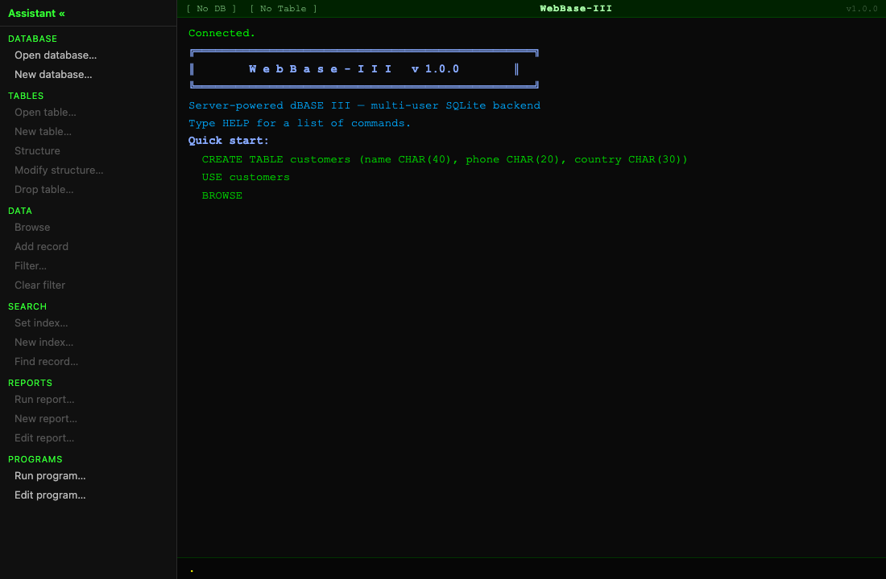
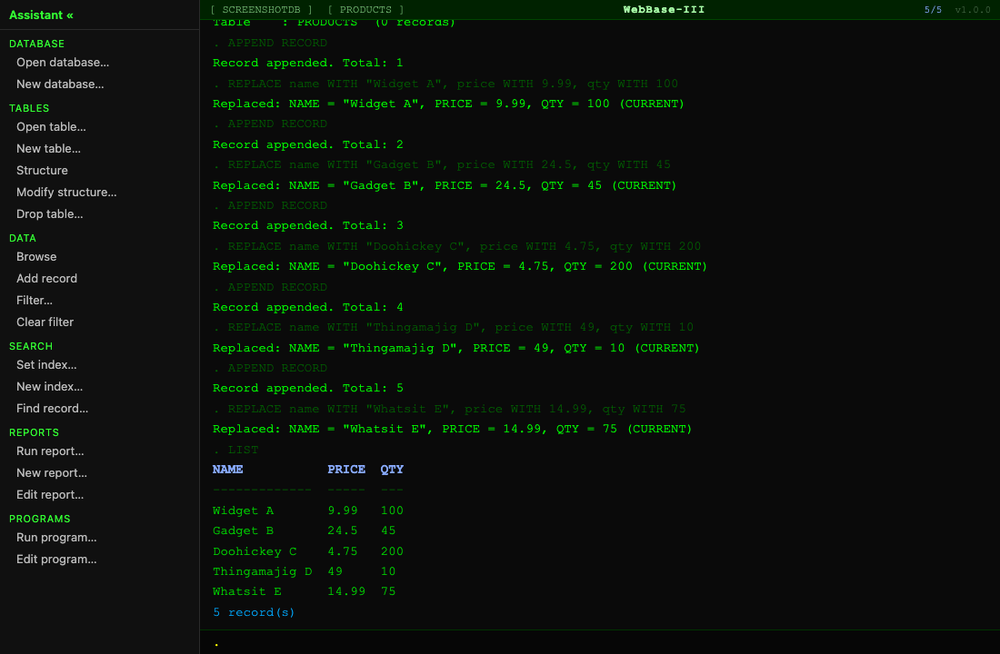
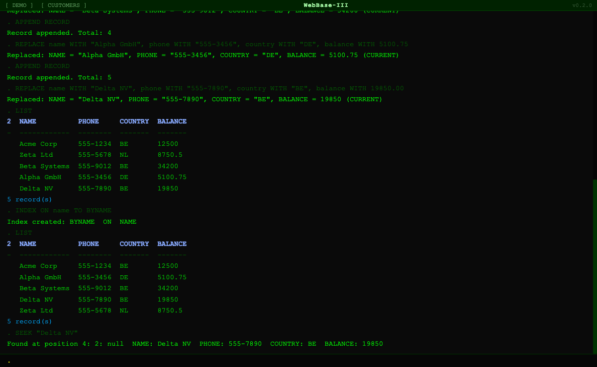
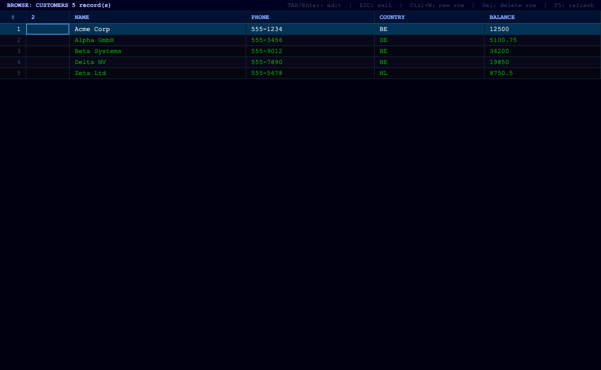
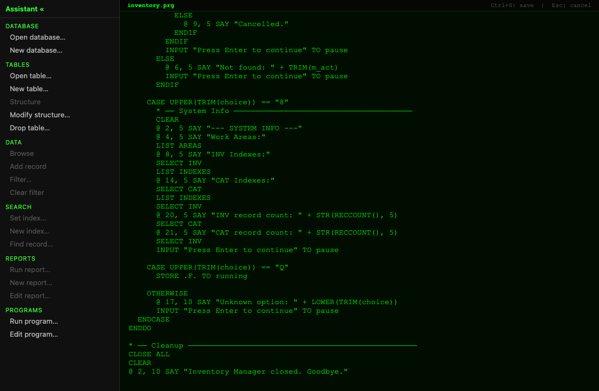
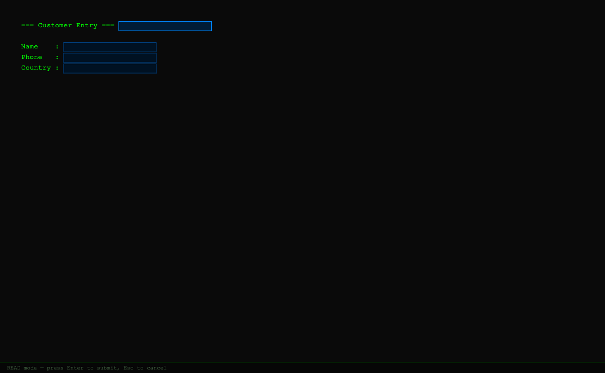

# WebBase-III

**dBASE III, reimagined for the modern web.**

Write W3Script commands in a retro terminal REPL, browse and edit records in a spreadsheet grid, build character-cell data-entry forms, run programs with full control flow — all backed by a Node.js WebSocket server and SQLite. Multiple users, persistent databases, no native dependencies beyond Node.

---

## Screenshots

### Terminal REPL

The command interface — type W3Script and see results instantly.



---

### LIST — tabular record display

`LIST` prints all records in active index order. The status bar shows the active database and table.



---

### Indexing & SEEK

`INDEX ON name TO BYNAME` creates a SQLite index and activates it — subsequent `LIST` output is sorted alphabetically. `SEEK "Delta NV"` jumps the record pointer to the first match in O(log n).



---

### BROWSE — editable grid

`BROWSE` opens a spreadsheet-style grid. Records are shown in active index order. Tab/Enter to edit a cell, Ctrl+N for a new row, Delete to remove a row, Esc to return to the terminal.



---

### Program editor

`EDIT <name>` opens the built-in `.prg` source editor. Programs support the full W3Script language: `DO CASE/ENDCASE`, `DO WHILE/ENDDO`, `IF/ENDIF`, form layouts, and all data commands. Ctrl+S saves, Esc cancels.



---

### Form engine — `@ SAY GET` / `READ`

`@ row,col SAY "label" GET variable` lays out character-cell form fields. `READ` renders them as a live form and waits for the user to fill in values and submit.



---

## Features

| Feature | Details |
|---|---|
| **W3Script interpreter** | dBASE III command dialect: navigation, filters, variables, loops, conditionals, forms, programs |
| **BROWSE grid** | Inline cell editing, keyboard nav, index-ordered display |
| **Form engine** | `@ ROW,COL SAY … GET` character-cell layout with `READ` |
| **Indexing** | `INDEX ON`, `SEEK`, `FIND` — active index controls all record order |
| **DO CASE** | Multi-branch conditional, `OTHERWISE` fallback |
| **Built-in functions** | `EOF()`, `BOF()`, `FOUND()`, `RECNO()`, `SUBSTR()`, `STR()`, `AT()`, `CTOD()`, `DTOC()` and more |
| **Program files** | Save, edit, and run `.prg` scripts with `DO` / `EDIT` |
| **Multi-user** | Each WebSocket connection gets its own isolated interpreter session |
| **Persistent storage** | `better-sqlite3` with WAL mode — databases survive server restart |

---

## Quick start

```bash
npm install
npm run dev        # http://localhost:5173
```

Production:

```bash
npm run serve      # builds, then serves everything on http://localhost:3000
```

LAN / Tailscale: the server binds to `0.0.0.0`, so `http://<tailscale-ip>:3000` works out of the box.

---

## Example session

```
USE DATABASE mydb
CREATE TABLE customers (name CHAR(40), phone CHAR(20), country CHAR(30))
USE customers

APPEND RECORD
REPLACE name WITH "Acme Corp", phone WITH "555-1234", country WITH "BE"
APPEND RECORD
REPLACE name WITH "Zeta Ltd", phone WITH "555-5678", country WITH "NL"

INDEX ON name TO BYNAME
LIST                        * sorted A→Z

SEEK "Zeta Ltd"             * jump to record instantly
BROWSE                      * open editable grid
SET FILTER TO country == "BE"
LIST                        * filtered view
SET FILTER TO               * clear filter
```

---

## W3Script command reference

### Work areas

WebBase-III supports **unlimited work areas** — each independently holding a table, record pointer, filter, and index. Link areas by key field using `SET RELATION TO` for relational data access. Cross-area field access uses `alias.field` dot notation.

> **Note:** dBASE III supported a maximum of 10 work areas (DOS file handle limit). WebBase-III has no such limit. dBASE III used `alias->field` arrow syntax; WebBase-III uses modern `alias.field` dot notation.

| Command | What it does |
|---|---|
| `SELECT <alias>` | Activate (or create) a work area by name |
| `USE <table> [ALIAS <name>]` | Open table in active area; optional alias override |
| `SET RELATION TO <expr> INTO <alias>` | Link active area to another; auto-seeks on every navigation |
| `SET RELATION TO` | Clear relation on active area |
| `LIST [col, alias.col, ...]` | List records; optional column list with cross-area fields |
| `LIST AREAS` | Show all open work areas, pointers, indexes, and relations |
| `CLOSE` | Close active area's table |
| `CLOSE ALL` | Close all work areas, reset to single empty area `1` |

**Cross-area field access**: use `alias.field` dot notation anywhere an expression is accepted — `SET FILTER TO`, `IF`, `REPLACE`, `LIST`, `INDEX ON`.

### Data & navigation

| Command | What it does |
|---|---|
| `USE <table>` | Select a table; restores any saved active index |
| `USE DATABASE <name>` | Open a named SQLite database |
| `LIST` | Print records in active index order (up to 500) |
| `LIST STRUCTURE` | Show column schema |
| `LIST TABLES` | Show all tables with record counts |
| `LIST DATABASES` | Show all databases on disk (alias: `LIST DBS`) |
| `BROWSE` | Open the editable grid |
| `CLEAR` | Clear terminal output |
| `CREATE TABLE <n> (col TYPE, ...)` | Create a table |
| `DROP TABLE <name>` | Delete a table |
| `APPEND RECORD` | Insert a blank row |
| `DELETE` / `DELETE ALL` | Delete current or all records |
| `PACK` | VACUUM the SQLite file |
| `GO TOP` / `GO BOTTOM` / `GO <n>` | Move record pointer |
| `SKIP <n>` | Move pointer forward/back |
| `REPLACE <field> WITH <val>, ...` | Update field(s) on current row |
| `REPLACE ALL <field> WITH <val>, ...` | Update all (filtered) rows |
| `SET FILTER TO <expr>` | Set a WHERE clause; empty clears it |

### Indexing & search

| Command | What it does |
|---|---|
| `INDEX ON <expr> TO <tag>` | Create index on expression; sets it active immediately |
| `SET INDEX TO <tag>` | Activate a previously created index |
| `SET INDEX TO` | Clear active index — restores natural insert order |
| `REINDEX` | Rebuild SQLite indexes for current table |
| `LIST INDEXES` | Print all indexes for current table with `*` active marker |
| `SEEK <expr>` | Position record pointer at first index match |
| `FIND <string>` | Alias for SEEK (unquoted string — dBASE III legacy form) |

### Programs

| Command | What it does |
|---|---|
| `DO <name>` | Run a saved `.prg` program |
| `EDIT <name>` | Open `.prg` source editor |
| `LIST PROGRAMS` | Show all saved programs |

### Variables & I/O

| Command | What it does |
|---|---|
| `STORE <val> TO <var>` | Assign a variable |
| `INPUT "prompt" TO <var>` | Collect keyboard input |
| `@ r,c SAY "text" GET <var>` | Define a form field |
| `READ` | Display the form and wait for submit |

### Control flow

| Command | What it does |
|---|---|
| `IF <cond> … ENDIF` | Conditional block |
| `DO WHILE <cond> … ENDDO` | Loop |
| `DO CASE … ENDCASE` | Multi-branch conditional (`CASE`, `OTHERWISE`) |
| `HELP` | Print command reference |
| `QUIT` | Exit |

### Built-in functions

Functions work anywhere an expression is accepted — `IF`, `DO WHILE`, `STORE`, `REPLACE`, `INDEX ON`, `SET FILTER TO`, etc.

| Function | Returns |
|---|---|
| `EOF()` | True if record pointer is past last record |
| `BOF()` | True if record pointer is before first record |
| `FOUND()` | True if last `SEEK` / `FIND` matched |
| `RECNO()` | Current record number |
| `RECCOUNT()` | Total records in current table |
| `UPPER(str)` | Uppercase |
| `LOWER(str)` | Lowercase |
| `TRIM(str)` | Strip leading and trailing spaces |
| `LTRIM(str)` | Strip leading spaces only |
| `SUBSTR(str, start, len)` | Substring — 1-based; `len` optional (to end) |
| `LEN(str)` | String length |
| `AT(needle, haystack)` | 1-based position; 0 if not found (case-sensitive) |
| `STR(num, len, dec)` | Number to right-justified string; default len=10, dec=0 |
| `VAL(str)` | String to number; non-numeric → 0 |
| `INT(n)` | Truncate toward zero |
| `ABS(n)` | Absolute value |
| `SPACE(n)` | String of n spaces |
| `REPLICATE(str, n)` | Repeat string n times |
| `DATE()` | Today as `MM/DD/YY` |
| `DTOC(date)` | Date to display string `MM/DD/YY` |
| `CTOD(str)` | Display string `MM/DD/YY` to ISO date |

### Boolean literals

W3Script supports both styles:

| Syntax | Value |
|---|---|
| `TRUE` / `FALSE` | Boolean true/false |
| `.T.` / `.TRUE.` | Boolean true (dBASE III style) |
| `.F.` / `.FALSE.` | Boolean false (dBASE III style) |

Boolean values display as `.T.` / `.F.` in output to match dBASE conventions.

---

## BROWSE grid keyboard shortcuts

| Key | Action |
|---|---|
| Arrow keys | Navigate cells |
| Enter / F2 | Edit selected cell |
| Tab / Shift+Tab | Move right / left |
| Ctrl+N | New row |
| Delete | Delete current row |
| F5 | Refresh from DB |
| Esc | Exit grid, return to terminal |

---

## Architecture

```
server/
  index.ts              Node.js HTTP + WebSocket server (port 3000)
  Session.ts            Per-connection session: parses commands, drives Executor
  SessionManager.ts     Tracks all active sessions
  ServerDatabaseBridge.ts  IDatabaseBridge impl wrapping better-sqlite3
  ProgramStore.ts       .prg program storage in data/system.sqlite3
  IndexStore.ts         Index metadata + active index in data/system.sqlite3

src/
  interpreter/
    Lexer.ts            Tokenises W3Script input (case-insensitive)
    Parser.ts           Recursive-descent AST builder
    Executor.ts         Async AST runner; manages db/table/filter/vars/rowPtr/activeIndex
    Builtins.ts         Stateless built-in function implementations

  terminal/
    Terminal.ts         REPL UI — command history, multi-line block accumulation

  ui/
    Grid.ts             BROWSE spreadsheet — inline cell editing, keyboard nav
    FormLayout.ts       @ SAY GET form engine — character-cell coordinates
    ProgramEditor.ts    .prg source editor UI

  ws/
    WsClient.ts         Browser WebSocket client
```

---

## Running tests

```bash
npm test                    # unit + integration tests (Vitest)
npx playwright test         # end-to-end browser tests (requires dev server running)
```

The Playwright suite (`tests/integration.spec.ts`, `tests/crm.spec.ts`) drives a real browser against the running app and covers navigation, filters, indexing, programs, forms, and BROWSE.

---

## License

AGPL-3.0 — see [LICENSE.md](LICENSE.md).
